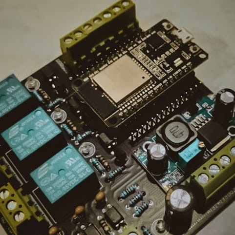
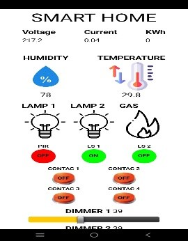
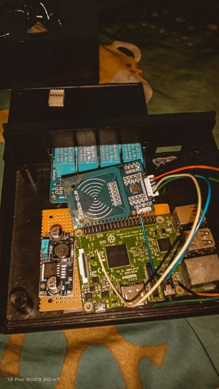
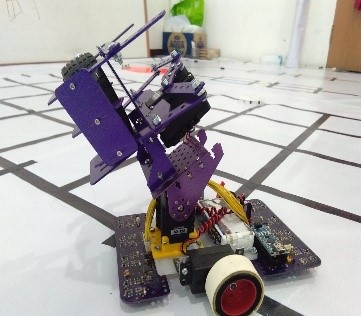
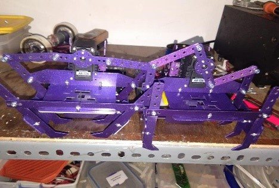

# Hi there, I'm Faudzan Sauri | [Faudzan](https://www.youtube.com/@faudzansauri7620) 👋
## About me: 
- 🔭 I’m currently working as Electrical Engineering
- 🌱 I’m currently learning VB and PYHTON
- 👯 I’m looking to collaborate as ELectrical and Website
- 🤔 I’m looking for suggest for Rust Project Ideas
- 💬 Ask me about anything
- 📫 How to reach me: Faudzansauri@gmail.com

## Experience :

#### 1. Smart Home IoT

 </img> 
</img>
<h4 align="center" > Gambar 1  :  Desain Hardware (A) Desain aplikasi Smarthphone(B) </h4> 

Pada gambar 1 bagian A merupakan gambar desain hardware PCB yang telah dirancang melalui EAGLE PCB yang terdapat beberapa sensor suhu,temperature,arus,tegangan,dan beberapa relay untuk mengatur sebuah beban listrik.Didalam aplikasi android seperti pada gambar 1 bagian B, juga terdapat fungsi dimmer atau sebuah pengatur kecerahan pada lampu yang dapat dikendalikan dengan jarak jauh menggunakan IoT.Project ini  dalam rangka membantu dosen untuk bahan ajar KKN kepada sekolah-sekolah SMK pada Surabaya dan sidoarjo 

#### 2. Prototype Parking sistem

 </img> 
</img>
<h4 align="center" > Gambar 2 Sistem kamera (A) Sistem kontrol(B)</h4> 

Prototype parking sistem adalah sebuah sitem parkir otomatis yang telah ter-integrasi oleh sistem pintar yang memiliki sistem tapping kartu bisa dengan KTP atau card id pada sebuah instansi seperti pada gambar 2B , sistem ini memiliki kamera yang dapat memfoto kendaraan yang akan masuk seperti pada gambar 2A kemudian foto ini akan di simpan pada database yang di kelola oleh rassbery pi 3B dengan bahasa pemrograman MSQL dan PYTHON yang berfungsi sebagai server .Project ini adalah sebagai uji coba mandiri yang dilakukan di rumah.

#### 3. Realtime Website monitoring

 </img> 
</img>
<h4 align="center" > Gambar 3  Hardware Panel surya(A) Sistem kontrol (B)</h4> 

Pada gambar 3 merupakan hardware sistem pengisian batrey pada aki, pada hal ini sistem akan mencatat proses pengisian yaitu tegangan dan arus yang akan disimpan pada sdcard kemudian setiap 2jam sekali sistem akan mengupload isi sdcard untuk ditampilkan pada website.

 </img> 
</img>
<h4 align="center" > Gambar 4 Interface Realtime Monitoring (A) Data logger website (B)</h4> 

Setiap 2 jam sekali sistem akan mengupload data kedalam database yang akan ditampilkan pada gambar 5B ,sistem juga dapat menampilkan nilai atau data dalam  5 detik sekali memperbarui data terbaru secara realtime seperti pada gambar 5A. Project ini adalah sebagai bahan penelitian dosen untuk melanjutkan Studi pada Program Doktoral.

#### 4. Robot Transporter

 </img> 
</img>
<h4 align="center" > Gambar 5 Perancangan robot transporter </h4> 

Robot transporter adalah robot pemindah barang yang berjalan secara otomatis yang dapat berjalan dan memindahkan barang .Robot ini adalah untuk proses kontes robot atau perlombaan tingkat smp-sma , saya sebagai perancang dan pemrogam untuk mebuat robot transporter ini agar mudah digunakan oleh adik adik SMP-SMA yang mengikuti ekstrakulikuler pada sekolah.Project ini adalah Research And Devlopment pada saat bekerja pada AWG robotic yang di gunakan sebagai robot kontes perlombaan.

#### 5. Website Penjualan

 </img> 
</img>
<h4 align="center" > Gambar 6 website penjualan dan stok gudang </h4> 

Membuat website penjulan yang menampilkan informasi toko penjualan dan membuat list database stok barang pada gudang serta dapat menampilkan informasi laporan penjualan, hal ini dapat memudahkan para karyawan dan pemilik agar proses penjualan dan update stok barang dengan mudah dan lebih efesien. Project ini adalah sebagai uji coba mandiri yang dilakukan di rumah.

---

### Languages and Tools:

[][webdev]
[][webdev]
[][webdev]
[][webdev]
[][webdev]
[][webdev]
 
 

---
### Connect with me:

&nbsp;&nbsp;

&nbsp;&nbsp;

[webdev]: https://github.com/Faudzansauri09
